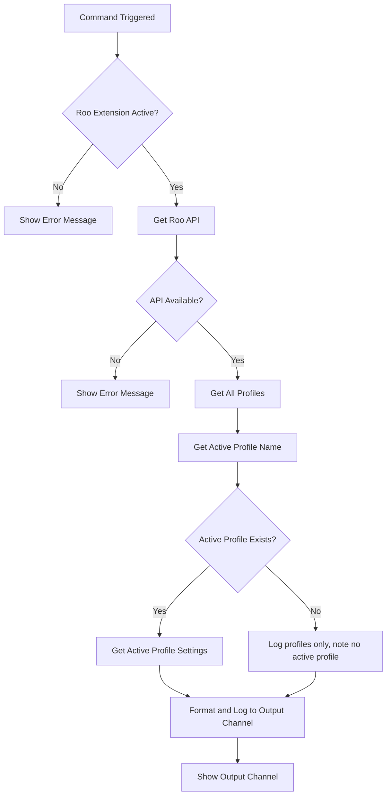

# Implementation Plan: Log Profiles Command

## Overview

Add a new VS Code command `roo-api-test.log-profiles` that logs all available Roo profiles and the settings of the currently active profile to a dedicated VS Code Output Channel.

## Requirements

- **Command ID**: `roo-api-test.log-profiles`
- **Command Title**: "Log Roo Profiles and Settings"
- **Output**: Log to a dedicated VS Code Output Channel named "Roo API Test"
- **Information to Log**:
  1. List of all available profile names
  2. Name of the currently active profile
  3. Full settings of the active profile

## Files to Modify

### 1. package.json

Add the new command to the `contributes.commands` array:

```json
{
  "command": "roo-api-test.log-profiles",
  "title": "Log Roo Profiles and Settings"
}
```

### 2. src/extension.ts

Modifications needed:

1. **Create Output Channel**: Create a VS Code Output Channel at the module level for logging
2. **Register New Command**: Add a new command handler that:
   - Checks if the Roo extension is active
   - Retrieves all profiles using `api.getProfiles()`
   - Gets the active profile name using `api.getActiveProfile()`
   - Fetches the active profile settings using `api.getProfile(name)`
   - Formats and logs all information to the Output Channel
   - Shows the Output Channel to the user

## Implementation Details

### Output Channel Creation

```typescript
const outputChannel = vscode.window.createOutputChannel("Roo API Test");
```

The output channel should be:
- Created at module level or in the activate function
- Added to the extension context subscriptions for proper disposal

### Command Logic Flow



### Output Format

The output should be formatted clearly for readability:

```
========================================
Roo Code Profiles and Settings
========================================
Timestamp: 2025-12-19T04:40:00.000Z

All Profiles:
  - profile1
  - profile2
  - profile3

Active Profile: profile1

Active Profile Settings:
{
  "apiProvider": "openrouter",
  "openRouterApiKey": "***",
  "openRouterModelId": "anthropic/claude-3.7-sonnet"
}
========================================
```

### Security Consideration

API keys and sensitive information should be masked in the output. Consider replacing sensitive fields like:
- `apiKey`
- `openRouterApiKey`
- `awsAccessKey`
- `awsSecretKey`
- Any field ending with `Key` or `Token`

## Code Changes Summary

### package.json Changes

Add to `contributes.commands` array:

```diff
 "commands": [
   {
     "command": "roo-api-test.configure-roo",
     "title": "Configure Roo Code"
+  },
+  {
+    "command": "roo-api-test.log-profiles",
+    "title": "Log Roo Profiles and Settings"
   }
 ]
```

### src/extension.ts Changes

1. Add output channel creation
2. Add helper function to mask sensitive values
3. Add new command registration
4. Add output channel to subscriptions

## Testing

After implementation, test the command by:

1. Open VS Code with this extension installed
2. Ensure the Roo Code extension is also installed and active
3. Open the Command Palette (Ctrl+Shift+P / Cmd+Shift+P)
4. Run "Log Roo Profiles and Settings"
5. Verify the Output panel opens with the "Roo API Test" channel selected
6. Confirm all profiles are listed
7. Confirm active profile settings are displayed with sensitive values masked

## Edge Cases to Handle

1. **Roo extension not installed**: Show informative error message
2. **Roo extension not activated**: Show informative error message
3. **No profiles exist**: Log message indicating no profiles are configured
4. **No active profile**: Log message indicating no profile is currently active
5. **API errors**: Catch and log any errors from the API calls

## Checklist

- [ ] Add command to package.json
- [ ] Create output channel in extension.ts
- [ ] Implement sensitive value masking helper
- [ ] Register new command handler
- [ ] Handle edge cases and errors
- [ ] Test the command
